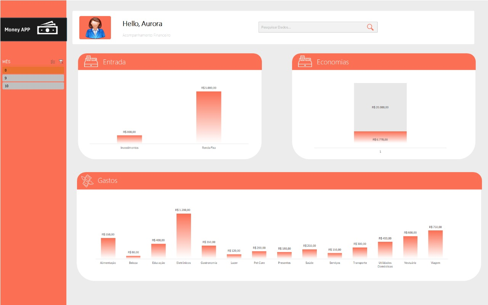

    

-------

# Projeto organizar sua vida Financeira com Planilhas Inteligentes e IA

 > ℹ️ **NOTE:** Este é o repositório desenvolvido durante o curso que realizei na plataforma da [DIO](https://dio.me)

O objetivo do projeto foi desenvolver um dashboard interativo utilizando Excel e Inteligência Artificial para facilitar o gerenciamento financeiro pessoal. A integração dessas ferramentas permitiu a automação de cálculos, análise de dados financeiros e a geração de insights, tornando o processo mais eficiente e intuitivo.
seguem abaixo.

<a href="https://github.com/AuroraCarvalho/Dio-pratica-ebook/blob/main/output/Ebook%20Dio%20-%20Copia.pdf" title="View PDF now"> 📕Clique aqui para ler</a>

## 💻 Tecnologias utilizadas no projeto

- [Microsoft excel ](https://www.microsoft.com/pt-br/microsoft-365/excel) 
- [Chat GPT](https://chatgpt.com/) 
## 🧠 Prompts

ChatGPT：

Prompt                                                                                                                                                                                                                                                                        -------------------------------------------------------------------------------------------------------------------------------------------------------------------------------------
                                                     |
| conteúdo | utilize a tabela de dados contida no documento acima, como base de conhecimento e me gere alguns insights dessas tabelas de gastos|

## ✨ Features

- Conteúdo gerado via ChatGPT
- Imagens geradas via excel

## 🛠️ Instruções de execução

Utilizei os prompts acima nas ferramentas sugeridas para gerar o material base e utilize uma ferramenta de edição de documentos como Excel e IA.

## 👨‍💻 Expert

    
    
&nbsp&nbsp&nbspAdauta carvalho 
    &nbsp&nbsp&nbsp
    <a href="https://github.com/AuroraCarvalho">
    GitHub</a>&nbsp;|&nbsp;
    <a href="https://www.linkedin.com/in/adauta-carvalho-exe">LinkedIn</a>
&nbsp;|&nbsp;
    <a href="https://www.instagram.com/aurora_carvalho15/">
    Instagram</a>
&nbsp;|&nbsp;

  

---

⌨️ com 💜 por [Adauta Carvalho](https://github.com/AuroraCarvalho)
